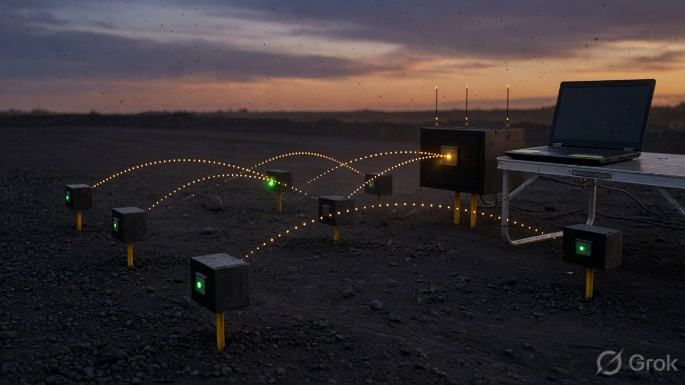
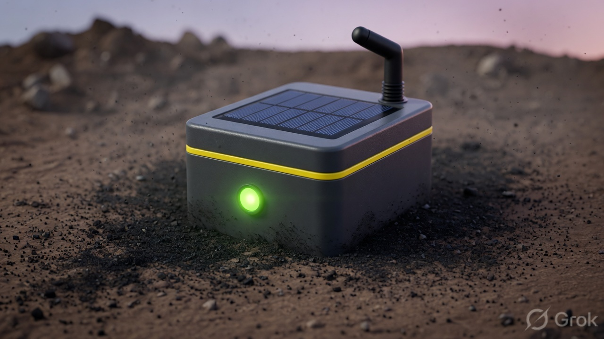
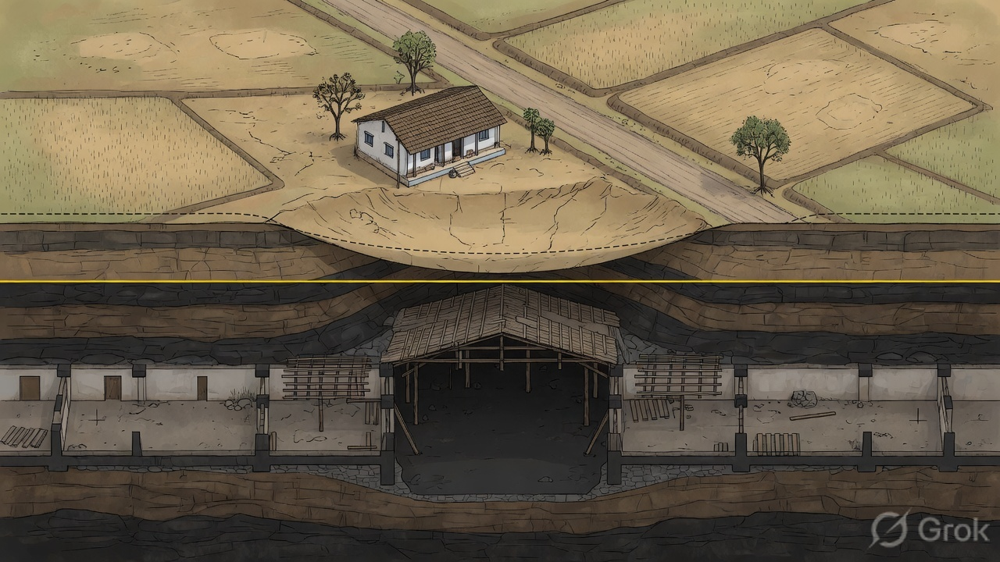
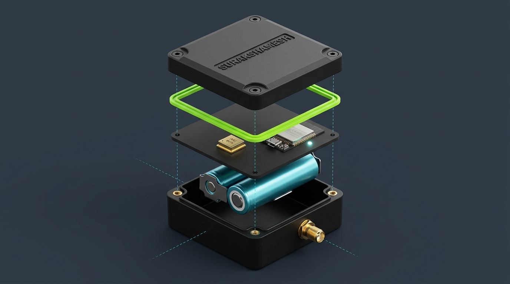
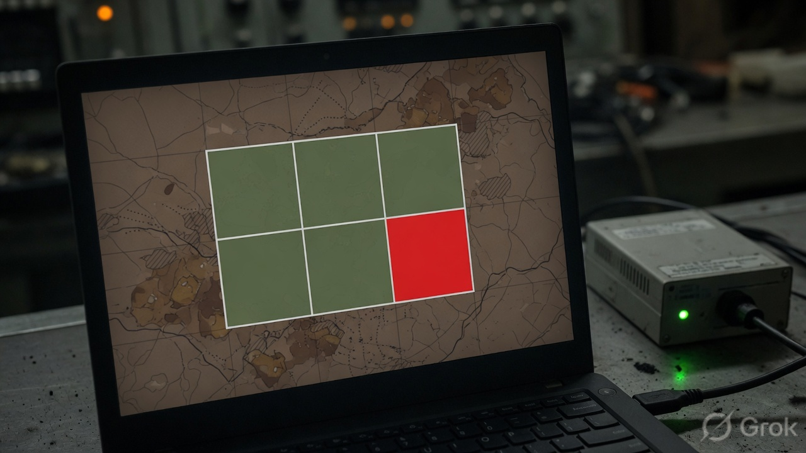

# SurakshaMesh

> **Real-Time Wireless Surface Sensor Mesh for Underground Mine Subsidence Monitoring & Early Warning**

[](LICENSE)
[]()
[]()
[]()

---

## 📌 Overview

**SurakshaMesh** is a low-cost, dense wireless surface sensor mesh designed for deployment above underground mining galleries and bord-and-pillar panels. It provides continuous, real-time detection of ground tilt, surface deformation, and vibration anomalies—delivering proactive early warnings before traditional periodic walk-around surveys detect surface cracking or structural damage.


*Figure 1: SurakshaMesh surface deployment model for continuous deformation tracking.*

---

## ✨ Key Features

- **High-Frequency Edge Telemetry:** ESP32 nodes process raw 6-DoF inertial data from MPU6050 sensors at 50 Hz using complementary filtering for pitch/roll and RMS acceleration for vibration monitoring.
- **Autonomous Multi-Tier Risk Engine:** On-device state machine categorizes ground stability into three risk levels:
  - 🟢 **Clear / Normal:** Nominal ground state.
  - 🟡 **Watch:** Minor angular drift ($\ge 2^\circ$) or elevated ambient vibration ($\ge 0.15\text{g}$).
  - 🔴 **Warning / Critical:** Significant tilt ($\ge 5^\circ$) or coincident vibration spikes with built-in hysteresis to eliminate false triggers.
- **Decentralized Local Wireless Mesh:** Zero-infrastructure peer-to-peer communication using **ESP-NOW** protocol (2.4 GHz) for rapid local synchronization, with field extensibility to **LoRa** (433/868 MHz) for long-range remote telemetry.
- **Dual Telemetry Interfaces:**
  - **Offline Flask Dashboard:** Central receiver streams JSON telemetry over USB-Serial (@ 115200 baud) to a lightweight local Python/Flask app with spatial grid mapping, acoustic alarms, and CSV logging.
  - **Next.js Web Interface:** Modern web dashboard with live charts, spatial risk maps, and historical analytics.
- **Parametric 3D Printable Enclosures:** Weather-resistant modular enclosure designed using parametric code in KCL (Zoo.dev).

---

## 🏗️ System Architecture

```
                       Surface Over Underground Panel
    ┌─────────────────┐      ┌─────────────────┐      ┌─────────────────┐
    │  Sensor Node 1  │      │  Sensor Node 2  │      │  Sensor Node N  │
    │  ESP32 + MPU6050│      │  ESP32 + MPU6050│      │  ESP32 + MPU6050│
    │  Local RGB Alert│      │  Local RGB Alert│      │  Local RGB Alert│
    └────────┬────────┘      └────────┬────────┘      └────────┬────────┘
             │                        │                        │
             └───────────────┬────────┴────────────────────────┘
                             │ ESP-NOW / LoRa Telemetry
                             ▼
                    ┌─────────────────┐
                    │ Central Gateway │ (Hub Node)
                    │ JSON @ 115200   │
                    └────────┬────────┘
                             │ USB Serial / HTTP
                             ▼
                ┌─────────────────────────┐
                │ Central Operator Center │
                │ - Live Spatial Grid     │
                │ - Anomaly & CSV Logging │
                │ - Acoustic Alerts       │
                └─────────────────────────┘
```

---

## 📸 Hardware & Design Showcase

| Node Hardware & Sensor Rig | Internal Cutaway & Assembly |
| :---: | :---: |
|  |  |
| *ESP32 + MPU6050 station with local visual feedback* | *Internal battery, sensor cradle, and electronics placement* |

| Parametric CAD Exploded Assembly | Spatial Telemetry Map |
| :---: | :---: |
|  |  |
| *Parametric 3D enclosure model designed in KCL* | *Spatial risk grid and continuous monitoring map* |

---

## 📊 Telemetry Packet Format

Nodes broadcast a serialized JSON telemetry packet once per second:

```json
{
  "id": 1,
  "pitch": 1.24,
  "roll": -0.41,
  "vib": 0.031,
  "t": 18440,
  "risk": 0
}
```

- **`id`**: Unique node identifier.
- **`pitch` / `roll`**: Tilt angles in degrees computed via complementary filter.
- **`vib`**: Root Mean Square (RMS) acceleration deviation in g ($1\text{g} = 9.81\,\text{m/s}^2$).
- **`t`**: Node uptime in milliseconds.
- **`risk`**: Risk classification state (`0`: Normal, `1`: Watch, `2`: Warning, `3`: Critical).

---

## 🛠️ Hardware Requirements & Pinout

### Bill of Materials (BOM)
- **Microcontroller:** ESP32 DevKit V1 (30-pin / 36-pin)
- **Sensor:** MPU6050 6-Axis Accelerometer & Gyroscope
- **Status Indicator:** Common Cathode RGB LED (with $3\times 220\,\Omega$ current-limiting resistors) or Active Buzzer (GPIO 14)
- **Power:** 5V USB power bank or 3.7V Li-ion battery with TP4056 charge controller

### Node Pin Mapping

| Peripheral | Component Pin | ESP32 GPIO |
| :--- | :--- | :--- |
| **MPU6050** | VCC | `3V3` |
| | GND | `GND` |
| | SDA | `GPIO 21` |
| | SCL | `GPIO 22` |
| | AD0 | `GND` (Address `0x68`) |
| **Active Buzzer** | Positive (+) | `GPIO 14` |
| | Negative (-) | `GND` |
| **RGB LED** | Red Anode | `GPIO 25` (via $220\,\Omega$) |
| | Green Anode | `GPIO 26` (via $220\,\Omega$) |
| | Blue Anode | `GPIO 27` (via $220\,\Omega$) |
| | Common Cathode | `GND` |

---

## 🚀 Getting Started

### 1. Firmware Setup (ESP32)

1. Open `firmware/node/node.ino` in **Arduino IDE** (or VS Code with PlatformIO).
2. Install the **esp32 by Espressif Systems** board definitions in the Board Manager.
3. Configure the node parameters at the top of the file:
   ```cpp
   #define NODE_INDEX   1    // Unique Node ID (1 for Gateway, 2/3 for Field Nodes)
   #define IS_GATEWAY   1    // Set 1 for Gateway connected to host, 0 for Field Nodes
   #define FLIP_PITCH   0    // Set 1 if sensor orientation is inverted
   ```
4. Flash the code to each node with baud rate set to `115200`.

### 2. Dashboard Setup (Python / Flask)

1. Navigate to the dashboard directory:
   ```bash
   cd dashboard
   ```
2. Install dependencies:
   ```bash
   pip install -r requirements.txt
   ```
3. Run the gateway server (specify your USB serial port):
   ```bash
   # Windows
   python app.py COM6

   # Linux / macOS
   python app.py /dev/ttyUSB0
   ```
4. Open your browser and navigate to `http://127.0.0.1:5000` to view the live dashboard.

---

## 📂 Repository Structure

```
surakshamesh/
├── cad/                      # Parametric 3D CAD enclosure models (KCL / Zoo.dev)
├── dashboard/                # Offline Flask telemetry interface
│   ├── app.py                # Serial listener and Flask backend
│   ├── templates/            # Web interface templates
│   └── data/                 # Telemetry logs (CSV)
├── docs/                     # Documentation & assets
│   └── images/               # Showcase images and render frames
├── firmware/                 # Node and Gateway firmware
│   └── node/
│       └── node.ino          # Unified ESP32 firmware (ESP-NOW + Sensors)
├── tools/                    # Serial-to-HTTP bridge & test scripts
├── app/                      # Next.js real-time web dashboard
├── LICENSE                   # MIT License
└── README.md
```

---

## 📜 License

This project is licensed under the [MIT License](LICENSE) - see the LICENSE file for details.

## 👤 Author

**Amit Kumar**  
- GitHub: [@amitxgit](https://github.com/amitxgit)  
- LinkedIn: [linkedin.com/in/kxamit](https://www.linkedin.com/in/kxamit/)
